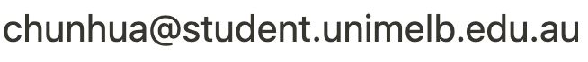

    

 
    

	  

	    

	      <b>Chunhua Liu</b> (刘春花 &middot; <i>chūn</i> 春 spring, <i>huā</i> 花 flower)
	       Postdoc Research Fellow and Associate Lecturer in NLP
	      <address>
		Melbourne Connect
	      </address>
	    

		

		  <a href="http://www.cis.unimelb.edu.au">Computing and Information Systems</a> 
		  <a href="http://www.unimelb.edu.au">The University of Melbourne</a> 
		  <a href="http://uom-nlp.github.io/">Natural Language Processing group</a>  
		  <a href="https://cis.unimelb.edu.au/research/computer-science/research/software-engineering">Software Engineering group</a>
		

	  

	  

	    

	
	<noscript></noscript>
	    

	    
 Ph: +61000000000 

	    

	

    

I am a Postdoctoral Research Fellow and Associate Lecturer in NLP at The University of Melbourne, working with <a href="https://scholar.google.com/citations?user=xMne5ZUAAAAJ&hl=en">Prof Eduard Hovy</a> and <a href="https://www.frermann.de/">Dr Lea Frermann</a> on cultural and value alignment in language models. My research develops human-centred NLP systems that reliably adapt to the diverse meanings, values, and behaviours of people across cultures and societies.

My work spans three interconnected themes: (1) <b>cultural alignment of language models</b> — grounding LLMs in diverse cultural and moral values (ACL 2025, ACL 2026); (2) <b>understanding diversity in human meaning</b> — studying how word meanings and semantic associations vary across cultures using cognitive psychology methods (WAX, CogSci 2026); and (3) <b>human–AI communication and persuasion</b> — examining how LLMs can adapt and how that power can be misused or steered. I also apply NLP to software engineering, with a focus on trustworthy automated code review (MSR 2025, ACL 2025, TOSEM 2025).

Previously, I completed a postdoc with <a href="https://patanamon.com/">A/Prof Patanamon Thongtanunam</a> on empirical software engineering, and a PhD under <a href="https://people.eng.unimelb.edu.au/tcohn/">Prof Trevor Cohn</a> and <a href="https://www.frermann.de/">Dr Lea Frermann</a> on commonsense reasoning via human word associations.

I am actively seeking academic positions (lecturer, senior lecturer, research scientist) in NLP and related areas. Feel free to reach out via email (chunhua.liu1{at}unimelb.edu.au) or <a href="https://www.linkedin.com/in/chunhua-liu-977626177/">LinkedIn</a>.

<h3>News</h3>
<ul>

  <li><i>{{ item.date }}</i>: {{ item.text }}</li>

</ul>
