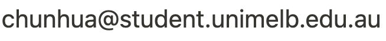

    

 
    

	  

	    

	      <b>Chunhua Liu</b>
	       PhD Student
	      <address>
		Melbourne Connect
	      </address>
	    

		

		  <a href="http://www.cis.unimelb.edu.au">Computing and Information Systems</a> 
		  <a href="http://www.unimelb.edu.au">The University of Melbourne</a> 
		  <a href="http://uom-nlp.github.io/">Natural Language Processing group</a>
		

	  

	  

	    

	
	<noscript></noscript>
	    

	    
 Ph: +61000000000 

	    

	

    

I am a PhD student in natural language processing at The University of Melbourne under the supervision of <a href="https://people.eng.unimelb.edu.au/tcohn/">Trevor Cohn</a> and <a href="https://www.frermann.de//">Lea Frermann</a>. My research interests center around understanding the structure and relationships between concepts through interdisciplinary perspectives, including natural language processing and cognitive psychology. With a specific emphasis on understanding the structure and reasons behind human word associations, evaluating the potential of word associations as a source of commonsense knowledge and incorporating commonsense knowledge to improve neural models' reasoning ability on tasks, such as commonsense question answering and natural language inferences. Additionally, I am interested in exploring concept representation and categorization across languages and cultures.

<h3>News</h3>
<ul>

  <li><i>{{ item.date }}</i>: {{ item.text }}</li>

</ul>

<h3>Recent Papers</h3>

  


